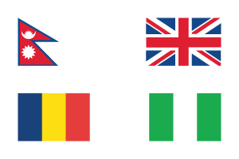

# Flags of the World

You'll find most of country's flags in svg, named by their [ISO 3166 code](https://www.iso.org/obp/ui/#search/code/) (because it's easier to use, yeah).

Source there: [The Noun Project](https://thenounproject.com/desbenoit/collection/flags-of-the-world/)

---

## [Changelog](CHANGELOG.md)

## [License](LICENSE)
